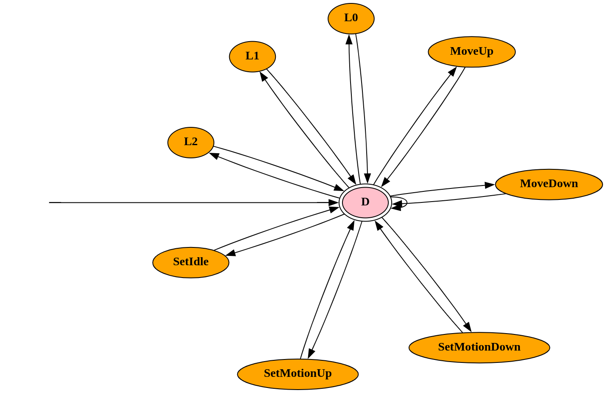

# Examples

This folder contains 4 example Cyclone specifications of a 3-floor elevator:
- `l3_stc.cyclone` demonstrates how an elevator moves in a fixed configuration
- `l3_dyn.cyclone` demonstrates how an elevator moves in a dynamic configuration
- `l3_prop_stc.cyclone` proofs our properties holds in fixed configuration
- `l3_prop_dyn_16.cyclone` proofs our properties holds in dynamic configuration and in 16 steps

Both `l3_stc` and `l3_dyn` should result in a single path showing how elevator moves. Optionally one can investigate traces.

Both `l3_prop_stc` and `l3_prop_dyn` should result in "No counter-example found" or `unsat` (for solving generated SMT), meaning properties are proven. 

## State Diagram

The state diagram is straightforward and shown at the following. The central `D` represents the *Decide* state in paper. Remaining states are actions to be conditionally dispatched. For instance, path `D->MoveUp->D` denotes "the elevator decides to move 1 floor upward". When no action is dispatched, the elevator enters a loop of `D->D`. 



The scenario in `l3_stc` and `l3_dyn` describes the following: *Initially the elevator is at level 1 under Up direction, there is an Up call at ground floor (L0), and there is no other call at initial state.* For fixed configurations, the only possible path is:
```
D->SetMotionDown->D->MoveDown->D->SetMotionUp->D->L0->D->SetIdle->D->D->...->D
```

This path shown the elevator first set to a down-direction to go to L0, then switch to up-direction, process the up-call and eventually idled. Specification `l3_stc` shown that this path exists, and this path is the *only* path possible, using Cyclone's `enumerate` mode. 

However for dynamic configurations, any possible new calls can be appended at any point, thereby there exists infinitely many possible paths. 

Next we first show how to run the example using Cyclone to reproduce the path, then further explain how the *path length* (the number of state transitions, ie, the amount of `->`) is decided. 

## Running Examples

There are 3 ways to run these examples. 

### Online Editor
Copy & paste the content of a particular `cyclone` file to [Cyclone online editor](https://cyclone.cs.nuim.ie/editor). Click "Run" button to see effect. 

**NOTE:** Online editor has a 10-second hard timeout. For property verification it would be better to run locally. 

### Run Locally

#### Cyclone (Java)
After [Cyclone (Java version) is installed](https://classicwuhao.github.io/cyclone_tutorial/installation.html), one may use `jar` executable to run the examples. Here we take the instance of `l3_stc.cyclone`:

```shell
java -jar /path/to/cyclone.jar l3_stc.cyclone
```

Cyclone then outputs:
```
./l3_stc.cyclone
Generating graph conditions...
Generation is successful.
Mode: Enumeration
Options: [trace:true]
Generated Conditions:  120584
Launching solver...
Solver:  Z3-4.13.0.0 (amd64)
Path 0: D->SetMotionDown->D->MoveDown->D->SetMotionUp->D->L0->D->SetIdle->D->D->D->D->D->D->D->D->D->D->D->D->D->D->D->D->D
Solving completed:335 msc
Total Path(s): 1
Trace Generated:/path/to/elevator-cyclone-smt/example/trace/l3_stc.trace
Time Spent:442 msc
```

Notice that time here also includes formulae compilation time. One can investigate the trace in corresponding location. 

#### Cyclone (Rust)
Optionally, one can try out Cyclone (Rust version) as an alternative. It uses different encoding than Java version. First extract `/cyclone-versions/cyclone-rs.zip` to get `cyclone-native` Linux binary. Then:
```shell
/path/to/cyclone-native l3_stc.cyclone
```

Which outputs:
```
Cyclone Native : Alternative Cyclone Implementation
Repository: https://github.com/lucid-brndmg/cyclone-rs
Use -h to see options

Input: l3_stc.cyclone
Solver: Z3 4.15.1.0 b665c99d0608fd392b951a04559191f97a51eb38 NOTFOUND

Estimated maximum graph analysis complexity: 2106 edges
Enumerating for length 26, possible paths: 717897987691852588770249

Checking length: 26, reachable nodes: 227, choice points: 225, optimized checks: 0
Path 0 (length 26): D->SetMotionDown->D->MoveDown->D->SetMotionUp->D->L0->D->SetIdle->D->D->D->D->D->D->D->D->D->D->D->D->D->D->D->D->D
=== TRACE ===

... TOML format trace output ...

Total checked 2 formulae: 1 unsat, 0 unknown, 1 sat, took 112ms
Total took 130ms
```

## Selecting Path Length

Cyclone supports checking or enumerating for a path length `k` such as `check for k`. This section further explains the choice of path length `k`. 

### Fixed Configuration

In fixed configurations, there exists a large enough `k` to cover all possible scenarios for `n` floors. Since there is no extra input when elevator is running, given any initial scenario:
- There can be maximum `2n` floors to be visited (once up and once down). 
- There can be maximum `2 (n - 1) - 1` movements (`MoveUp` or `MoveDown`) between each floor. Notice initial floor already handled once in either up or down mode, which the elevator will not move to there the second time. 
- There can be maximum 4 direction switches: Initially idled, then to up or down, then to the opposite and finally idled again. Once idled the second time, there can be no further switching. 
- It takes 2 steps to dispatch an action, ie, `D->S->D` where `D` is `Decide` and `S` is any other state (e.g., `MoveUp`). 

Therefore, the total possible steps for `n`-floor elevator is `8n + 2`. For a 3-floor elevator, this is 26. Notice that for dynamic configuration this is incorrect, as there exists infinite possibilities. 

To confirm this, at `goal` of `l3_stc.cyclone`, one can assert the following:
```cyclone
assert m != I; // find an example that the elevator eventually is NOT idled.
check for 26   // such example should be found within 8n + 2 steps. 
```

Cyclone should output `No path found`, which confirm our calculation by not finding any counter-examples. 

### Dynamic Configuration

The difference between fixed and dynamic configuration is the modeling of external requests while elevator moving. A dynamic configuration allows any new requests being appended at any time. This is implemented using [the `fresh` expression](https://classicwuhao.github.io/cyclone_tutorial/expr/fresh.html), which assigns a current variable to a new free constant at every occurrence. 

For verification of dynamic configuration, one must manually specify maximum path length, because there can be infinite possibilities at any step. In the paper we specified 4, 8, 16, 32 steps. Here the example path length is 16. 

